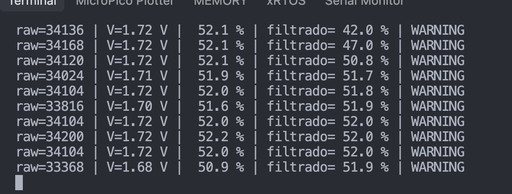
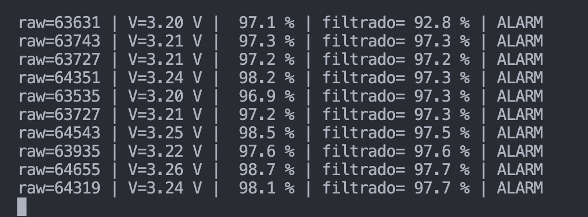
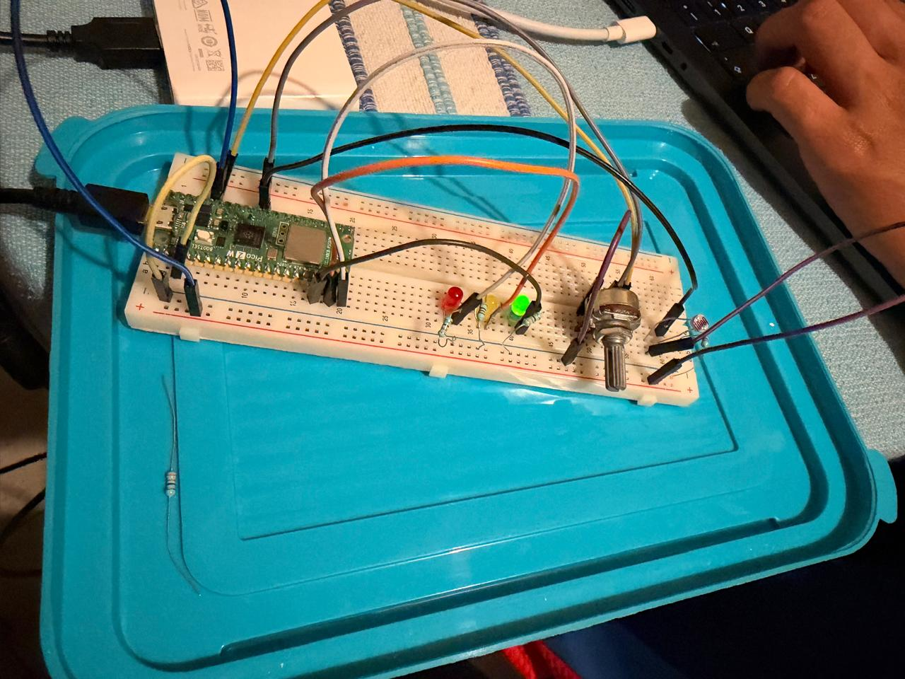

# Sesión 07 · Conversión ADC y acondicionamiento de señal
### CHALLENGE 07 · Smart Analog Monitor

**Laboratorio de Elementos Programables I**
**Alumno:** Jonathan Hernández Lazcano
**Placa:** Raspberry Pi Pico 2 W · MicroPython
**Herramientas:** Wokwi (simulación) + montaje físico en protoboard

---

## 1. Objetivo

Construir un monitor analógico que lea una señal continua en un pin ADC, la convierta en datos útiles (voltaje y porcentaje), la filtre para eliminar ruido y la clasifique en tres estados (**NORMAL / WARNING / ALARM**) que se muestran con LEDs y por terminal serial.

```
señal analógica → ADC → número → voltaje / % → filtro → estado → alarma
```

---

## 2. ¿Qué es el ADC y qué significa `read_u16()`?

Un **ADC** (Analog-to-Digital Converter) convierte un voltaje continuo en un número entero. Un GPIO digital solo pregunta "¿encendido o apagado?"; el ADC pregunta "¿cuánto?".

El proceso tiene dos pasos:

1. **Muestreo:** se toma una "foto" de la señal en un instante (en este proyecto, cada 300 ms).
2. **Cuantización:** ese voltaje se convierte en un número entero.

En MicroPython, `read_u16()` devuelve una lectura **normalizada de 16 bits**, es decir, de **0 a 65535** (2¹⁶ − 1), sin importar la resolución física del ADC interno.

| Voltaje en el pin | `read_u16()` |
|---|---|
| 0.0 V | 0 |
| 1.65 V | ≈ 32767 |
| 3.3 V | 65535 |

**Pines ADC de la Pico:** GP26 (ADC0), GP27 (ADC1), GP28 (ADC2).
**Rango seguro:** 0 V ≤ entrada ≤ 3.3 V. Nunca aplicar 5 V.

---

## 3. Fórmulas de conversión

El ADC no sabe qué sensor está conectado: el programa le da significado al número con una regla de tres.

```python
voltage = raw * 3.3 / 65535      # lectura cruda → voltios
percent = raw * 100 / 65535      # lectura cruda → porcentaje
percent = max(0, min(100, percent))   # se limita a 0–100 %
```

---

## 4. Circuito

| Componente | Conexión | Pin físico Pico |
|---|---|---|
| Potenciómetro 10 kΩ · extremo 1 | 3V3(OUT) | 36 |
| Potenciómetro · cursor (SIG) | **GP26 / ADC0** | 31 |
| Potenciómetro · extremo 2 | GND | 38 |
| LDR + resistencia 10 kΩ (divisor) | nodo central → **GP27 / ADC1** | 32 |
| LED verde + 330 Ω | GP13 | 17 |
| LED amarillo + 330 Ω | GP14 | 19 |
| LED rojo + 330 Ω | GP15 | 20 |

**Divisor de voltaje para la LDR (montaje físico):**

```
3V3 ── LDR ──┬── GP27
             │
           10 kΩ
             │
GND ─────────┘
```

La LDR no genera voltaje; solo cambia su resistencia con la luz. Junto con la resistencia fija de 10 kΩ forma un divisor: al cambiar la luz, cambia el reparto de los 3.3 V y el ADC lo mide.

El sensor activo se elige en el código:

```python
ACTIVE_SENSOR = "POT"   # o "LDR"
```

📎 Simulación: ver [`wokwi/enlace_o_captura.md`](wokwi/enlace_o_captura.md)

---

## 5. Filtro de promedio móvil

Una lectura real del ADC tiene ruido: el valor "tiembla" aunque el sensor esté quieto. Si se decidiera el estado con una lectura aislada, un pico de ruido podría disparar una **falsa alarma**.

El promedio móvil guarda las últimas **10 lecturas** y usa su promedio:

```python
def filter_avg(new_value):
    window.append(new_value)
    if len(window) > WINDOW_SIZE:
        window.pop(0)          # se descarta la lectura más vieja
    return sum(window) / len(window)
```

**Analogía:** funciona como el velocímetro de un coche: no marca cada bache, muestra la tendencia.

**Costo del filtro:** con 10 muestras × 300 ms, la señal filtrada tarda ≈ **3 s** en alcanzar un cambio brusco. Es un intercambio intencional entre estabilidad y velocidad de respuesta.

---

## 6. Umbrales elegidos

| Estado | Rango (% filtrado) | LED |
|---|---|---|
| NORMAL | menor que `WARNING` | 🟢 verde (GP13) |
| WARNING | de `WARNING` a menos de `ALARM` | 🟡 amarillo (GP14) |
| ALARM | `ALARM` o más | 🔴 rojo (GP15) |

```python
WARNING = __   # ← completar con el valor usado
ALARM   = __   # ← completar con el valor usado
```

**Justificación:** _(explicar por qué se eligieron estos valores; por ejemplo, un sistema conservador que avisa antes de llegar al límite)._

La clasificación se hace siempre con la señal **filtrada**, no con la lectura cruda.

---

## 7. Arquitectura del código

El programa está dividido en funciones pequeñas, cada una con una sola responsabilidad, para poder probarlas por separado:

| Bloque | Función | Responsabilidad |
|---|---|---|
| Adquisición | `read_raw()` | Leer el ADC (0–65535) |
| Escalado | `to_voltage()`, `to_percent()` | Convertir a V y % |
| Filtrado | `filter_avg()` | Promedio móvil |
| Decisión | `classify()` | NORMAL / WARNING / ALARM |
| Actuación | `update_outputs()` | Encender un solo LED |
| Reporte | `print_status()` | Una línea por muestra en serial |

---

## 8. Resultados · Potenciómetro (GP26)

| Posición | Raw (rango) | Voltaje | % crudo | % filtrado (estable) | Estado |
|---|---|---|---|---|---|
| Mínima | 992 – 1 040 | 0.05 V | 1.5 – 1.6 % | 1.8 % | NORMAL 🟢 |
| Media | 33 368 – 34 200 | 1.68 – 1.72 V | 50.9 – 52.2 % | 52.0 % | WARNING 🟡 |
| Máxima | 63 535 – 64 655 | 3.20 – 3.26 V | 96.9 – 98.7 % | 97.7 % | ALARM 🔴 |

**Observaciones:**
- Los extremos no llegan exactamente a 0 ni a 65535 (mínimo ≈ 1 000, máximo ≈ 64 650). Es normal en hardware real: la resistencia de contacto del potenciómetro y el offset del ADC impiden llegar al valor ideal.
- En la posición media, el raw varía ±400 unidades, pero el filtrado se mantiene en 52.0 %.
- Al subir de golpe a la posición media, el filtrado tardó varias muestras en alcanzar al crudo (42.0 → 47.0 → 50.8 → 51.7 %): es el efecto esperado del promedio móvil.

---

## 9. Resultados · Fotoresistencia LDR (GP27)

| Lectura | Raw | Voltaje | % crudo | % filtrado | Estado |
|---|---|---|---|---|---|
| 1 | 1 952 | 0.10 V | 3.0 % | 2.2 % | NORMAL |
| 2 | 1 936 | 0.10 V | 3.0 % | 2.3 % | NORMAL |
| 3 | 2 000 | 0.10 V | 3.1 % | 2.3 % | NORMAL |
| 4 | 1 920 | 0.10 V | 2.9 % | 2.4 % | NORMAL |
| 5 | 2 016 | 0.10 V | 3.1 % | 2.5 % | NORMAL |
| 6 | 2 016 | 0.10 V | 3.1 % | 2.7 % | NORMAL |
| 7 | 1 760 | 0.09 V | 2.7 % | 2.7 % | NORMAL |
| 8 | 1 712 | 0.09 V | 2.6 % | 2.8 % | NORMAL |
| 9 | 1 760 | 0.09 V | 2.7 % | 2.9 % | NORMAL |
| 10 | 1 760 | 0.09 V | 2.7 % | 2.9 % | NORMAL |

**Observaciones:**
- El raw osciló entre 1 712 y 2 016 (≈ ±150) sin cambiar la iluminación: ruido real del ADC.
- El % filtrado subió gradualmente (2.2 → 2.9 %), sin saltos: el filtro cumple su función.
- El mismo algoritmo funcionó con un sensor distinto cambiando solo `ACTIVE_SENSOR`, lo que demuestra que la lógica no depende del potenciómetro.

---

## 10. Plan de pruebas

| # | Prueba | Esperado | Resultado obtenido | PASS/FAIL |
|---|---|---|---|---|
| 1 | ADC mínimo | raw cercano a 0 / 0 % | raw ≈ 1 008 / 1.5 % | ✅ PASS |
| 2 | ADC medio | raw cercano a 32767 / 50 % | raw ≈ 34 104 / 52.0 % | ✅ PASS |
| 3 | ADC máximo | raw cercano a 65535 / 100 % | raw ≈ 64 000 / 97.7 % | ✅ PASS |
| 4 | Filtro | la señal filtrada cambia suavemente | 42.0 → 47.0 → 50.8 → 51.7 % | ✅ PASS |
| 5 | Normal | LED verde activo | NORMAL con 1.8 % | ✅ PASS |
| 6 | Warning | LED amarillo activo | WARNING con 52.0 % | ✅ PASS |
| 7 | Alarm | LED rojo activo | ALARM con 97.7 % | ✅ PASS |
| 8 | Recuperación | vuelve a NORMAL al bajar la señal | WARNING (24.4 %) → NORMAL (17.9 %) | ✅ PASS |

---

## 11. Problemas encontrados y solución

| Problema | Causa | Solución |
|---|---|---|
| En Wokwi, mover la luz de la LDR no cambiaba nada | Se estaba ejecutando una versión del código que solo leía GP26 | Se cargó la versión con selector de sensor y se verificó la primera línea del serial |
| La LDR física tiene solo dos patas, a diferencia del módulo de Wokwi | El módulo de Wokwi trae el divisor integrado | Se armó el divisor con una resistencia de 10 kΩ |
| Dirección de la lectura distinta entre Wokwi y físico | En el módulo de Wokwi la LDR está del lado de GND (más luz → menos %); en el montaje físico está del lado de 3V3 (más luz → más %) | Se agregó la opción `INVERT` en el código |
| Los extremos del potenciómetro no llegan a 0 y 65535 | Resistencia de contacto y offset del ADC | Comportamiento normal del hardware; se documenta como diferencia frente a la simulación |

---

## 12. Simulación vs. hardware

| Wokwi | Placa física |
|---|---|
| Lecturas casi sin ruido | Ruido real de ±150 a ±400 unidades |
| Extremos exactos (0 y 65535) | Extremos ≈ 1 000 y ≈ 64 650 |
| LDR como módulo con divisor integrado | LDR de dos patas + divisor armado a mano |
| Valida la lógica | Valida la implementación |

---

## 13. Pregunta de análisis

**¿Por qué conviene filtrar antes de activar una alarma?**

Porque una lectura aislada puede estar contaminada por ruido eléctrico. En las pruebas físicas, el raw variaba cientos de unidades aunque el sensor no se moviera. Si la alarma dependiera de una sola lectura, un pico de ruido cerca del umbral podría encender el LED rojo sin que la condición real lo justificara (falsa alarma). El promedio móvil decide con la **tendencia** de las últimas lecturas, lo que hace al sistema estable y confiable, a cambio de un pequeño retraso en la respuesta.

---

## 14. Exit ticket

1. **¿Qué significa que el ADC convierta una señal analógica en un número?**
   Que mide un voltaje continuo y lo representa como un entero proporcional, para que el programa pueda compararlo y tomar decisiones.
2. **¿Por qué `read_u16()` llega hasta 65535?**
   Porque entrega un valor normalizado de 16 bits: 2¹⁶ − 1 = 65535.
3. **¿Cómo convertimos una lectura cruda a voltaje?**
   `voltaje = raw × 3.3 / 65535`.
4. **¿Por qué una lectura aislada puede provocar una falsa alarma?**
   Porque el ruido del ADC puede producir un pico momentáneo que cruce el umbral aunque la señal real no haya cambiado.
5. **¿Qué diferencia hay entre medir, filtrar y clasificar?**
   Medir es obtener el número del ADC; filtrar es suavizarlo para eliminar ruido; clasificar es convertir el valor filtrado en un estado (NORMAL / WARNING / ALARM) que activa una acción.

---

## 15. Conclusión

El ADC permite que el microcontrolador pase de leer estados binarios a medir magnitudes. Sin embargo, leer no es suficiente: la señal necesita **escalarse** para tener significado, **filtrarse** para ser estable y **clasificarse** para producir una decisión. El mismo algoritmo funcionó con dos sensores distintos (potenciómetro y LDR), y la comparación entre Wokwi y la placa física mostró efectos reales —ruido, extremos no ideales, cableado del divisor— que la simulación no refleja.

---

## Evidencia

```
Sesion_07_ADC_Signal_Conditioning/
├── README.md
├── main.py
├── wokwi/
│   ├── enlace_o_captura.md
│   └── diagram.json
└── evidence/
    ├── serial_raw_voltage.png
    ├── threshold_alarm.png
    └── hardware_photo.jpg
```

**Lectura serial: raw, voltaje y porcentaje filtrado**



**Umbral de alarma alcanzado**



**Montaje físico**



**Videos del funcionamiento:**

- Video 1: https://youtu.be/J37xOQ16ij0
- Video 2: https://youtu.be/Iyk5rGFSr8M

Evidencia adicional: [estabilización del filtro](evidence/serial_filter_settling.png) · [estado de LEDs en serial](evidence/serial_led_state.png) · [vista superior](evidence/hardware_photo_top.jpg) · [vista lateral](evidence/hardware_photo_side.jpg)

## Referencias

- MicroPython · `machine.ADC` documentation
- Raspberry Pi Pico 2 W datasheet · ADC pins
- Wokwi · Raspberry Pi Pico + MicroPython
- Laboratorio de Elementos Programables I · Sesión 07
